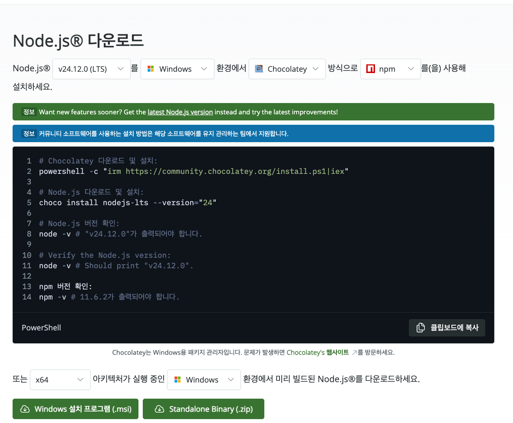
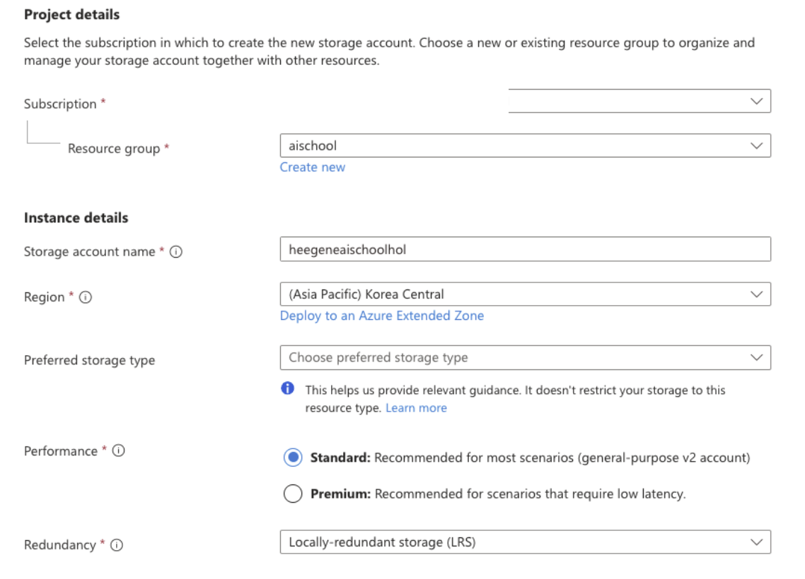

# 🎯 Microsoft Foundry Agent 핸즈온 워크샵

**Microsoft Agent Framework(MAF)를 활용한 AI Agent 개발 실습**

> ⏱️ 소요 시간: 약 2-3시간  
> 📊 난이도: L200-L300

---

## 📋 워크샵 개요

이 워크샵에서는 **Microsoft Agent Framework(MAF)**를 사용하여 다양한 AI Agent를 직접 구축합니다.

### 학습 목표

| Lab | 내용 | 시간 |
|-----|------|------|
| **Lab 0** | Microsoft Foundry 프로젝트 생성 및 환경 설정 | 20분 |
| **Lab 1** | 기본 챗봇 구현 | 30분 |
| **Lab 2** | RAG(Retrieval Augmented Generation) 챗봇 - Azure AI Search 연동 | 40분 |
| **Lab 3** | Tool Calling - 사칙연산 함수 호출 | 40분 |
| **Lab 4** | 통합 Agent - RAG + Tool Calling | 20분 |
| **Lab 5** | 웹 검색 Agent - Bing Search Grounding 연동 | 30분 |
| **Lab 6** | 오케스트레이터 Agent - 멀티에이전트 라우팅 | 30분 |

### 아키텍처

```
┌─────────────────────────────────────────────────────────────────┐
│                        Frontend (React)                         │
│                    http://localhost:5173/#/labs                 │
└─────────────────────────────────────────────────────────────────┘
                                │
                                ▼
┌─────────────────────────────────────────────────────────────────┐
│                     Backend (Python/Quart)                      │
│                    http://localhost:50505                       │
│  ┌────────────────────────────────────────────────────────────┐ │
│  │                  Microsoft Agent Framework                 │ │
│  │  ┌──────────────┐  ┌──────────────┐  ┌──────────────┐      │ │
│  │  │ BaseAgent    │  │  RAGAgent    │  │  ToolAgent   │      │ │
│  │  │ (Lab 1)      │  │  (Lab 2)     │  │  (Lab 3)     │      │ │
│  │  └──────────────┘  └──────────────┘  └──────────────┘      │ │
│  │  ┌──────────────┐  ┌──────────────┐  ┌──────────────┐      │ │
│  │  │CombinedAgent │  │WebSearchAgent│  │ Orchestrator │      │ │
│  │  │ (Lab 4)      │  │  (Lab 5)     │  │  (Lab 6)     │      │ │
│  │  └──────────────┘  └──────────────┘  └──────────────┘      │ │
│  └────────────────────────────────────────────────────────────┘ │
└─────────────────────────────────────────────────────────────────┘
                    │                       │
                    ▼                       ▼
    ┌───────────────────────────┐    ┌──────────────────────┐
    │   Microsoft Foundry       │    │  Azure AI Search     │
    │   (Agent Service)         │    │  ( RAG용 벡터 인덱스)   │
    │   - gpt-4.1               │    └──────────────────────┘
    └───────────────────────────┘
```

---

## 🚀 사전 준비 사항

### 필수 셋업

- **Python 3.10+** - [다운로드](https://www.python.org/downloads/)
- **Node.js 18+** - [다운로드](https://nodejs.org/)
- **Azure CLI** - [설치 가이드](https://learn.microsoft.com/ko-kr/cli/azure/install-azure-cli)
- **VS Code** (권장) - [다운로드](https://code.visualstudio.com/)

### Azure 리소스

| 리소스 | 용도 | 필수 |
|--------|------|:----:|
| Microsoft Foundry 프로젝트 | Agent Service 호스팅 | ✅ |
| gpt-4.1 모델 배포 | LLM 추론 | ✅ |
| Azure AI Search | RAG용 벡터 검색 | Lab 2 |
| Grounding with Bing Search | 웹 검색 기능 | Lab 4 |

---

## 📖 Lab 0: 환경 설정 (20분)

### (Optional) Step 0: 개발 도구 설치

Python, Node.js 등이 설치되어 있지 않다면 아래 명령어로 먼저 설치하셔야 합니다.

**macOS (Homebrew 사용):**
```bash
# Homebrew 설치 (없는 경우)
/bin/bash -c "$(curl -fsSL https://raw.githubusercontent.com/Homebrew/install/HEAD/install.sh)"

# Python 3.12 설치
brew install python@3.12

# Node.js 18+ 설치
brew install node

# Azure CLI 설치
brew install azure-cli

# 설치 확인
python3 --version   # Python 3.12.x
node --version      # v18.x 이상
npm --version       # 9.x 이상
az --version        # 2.x 이상
```

**Windows (PowerShell - 관리자 권한):**
**winget이 익숙하지 않으신 분들은 그냥 MSI installer로 설치하시면 됩니다. 하단에 적어두었습니다.**

```powershell
# winget 사용 (Windows 10/11 기본 제공)

# Python 3.12 설치
winget install Python.Python.3.12

# Node.js 18+ 설치
winget install OpenJS.NodeJS.LTS

# Azure CLI 설치
winget install Microsoft.AzureCLI

# 터미널 재시작 후 설치 확인
python --version   # Python 3.12.x
node --version     # v18.x 이상
npm --version      # 9.x 이상
az --version       # 2.x 이상
```
> 💡 Windows에서 `winget`이 없으면 [Microsoft Store](https://aka.ms/getwinget)에서 "앱 설치 관리자"를 설치하세요.

# node+npm MSI installer 기반 설치(Windows)
https://nodejs.org 에서 아래와 같이 Windows 옵션을 클릭하고 with NPM 옵션으로 드롭박스를 설정하고
(CPU 아키텍쳐는 본인이 사용 중인 로컬환경 PC 기준으로) 하단의 msi 다운로드를 눌러 설치합니다.


# az cli(Azure CLI) MSI installer 기반 설치(windows)
https://learn.microsoft.com/ko-kr/cli/azure/install-azure-cli-windows?view=azure-cli-latest&pivots=msi 링크를 통해 다운로드합니다.


### Step 1: Azure Microsoft Foundry 리소스 생성

1. **[Azure Portal](https://portal.azure.com)** 접속 및 로그인

2. **Microsoft Foundry 리소스 생성**:
   - 상단 검색창에 `Microsoft Foundry` 검색
   - **"+ 만들기"** 클릭
   - **기본 사항**:
     - 구독: 사용할 Azure 구독 선택
     - 리소스 그룹: 새로 만들기 또는 기존 선택 (예: `rg-maf-handson`)
     - 리전: `Korea Central`
     - 이름: `ai-foundry-{이니셜}` (예: `ai-foundry-hg`)
   - **"검토 + 만들기"** → **"만들기"**

3. **배포 완료 대기** (약 1-2분 소요)


### Step 2: Microsoft Foundry 프로젝트 생성

1. **[Microsoft Foundry Portal](https://ai.azure.com)** 접속 및 로그인

2. **새 프로젝트 생성**:
   - 좌측 메뉴에서 **"프로젝트"** 선택
   - **"+ 새 프로젝트"** 클릭
   - 프로젝트 이름: `maf-handson-{이니셜}`
   - Hub: **Step 1에서 생성한 Microsoft Foundry 리소스 선택**
   - **"만들기"** 클릭

3. **Endpoint 확인**:
   - 프로젝트 > **설정** > **프로젝트 속성**
   - `프로젝트 엔드포인트` 복사 (.env에 반영)
   - 형식: `https://<resource>.services.ai.azure.com/api/projects/<project-id>`

### Step 3: gpt-4.1 배포

1. 프로젝트 > **모델 + 엔드포인트** 선택
2. **"+ 모델 배포"** > **"기본 모델"** 선택
3. `gpt-4.1` 검색 후 선택
4. 배포 이름: `gpt-4.1` (냅두시면 어차피 모델명으로 배포 이름이 정해집니다)
5. **"배포"** 클릭

### Step 4: Azure AI Search 생성 (Lab 2용)

1. **[Azure Portal](https://portal.azure.com)** 접속
2. **"리소스 만들기"** > `Azure AI Search` 검색
3. 설정:
   - 서비스 이름: `search-maf-{이니셜}`
   - 가격 계층: **Basic** (핸즈온용, 데이터 매우 작게 넣으실 거면 Free tier도 가능)
4. **"검토 + 만들기"** → **"만들기"**

### Step 5: 로컬 환경 설정

**macOS / Linux (bash/zsh):**
```bash
# 1. 저장소 클론
git clone <repository-url>
cd aischool-handson

# 2. Python 가상환경 생성 및 활성화 (conda 쓰시면 conda 쓰셔도 무관)
python -m venv .venv
source .venv/bin/activate

# 3. 백엔드 패키지 설치
pip install -r app/backend/requirements.txt

# 4. 프론트엔드 패키지 설치
cd app/frontend
npm install
cd ../..
```

**Windows (PowerShell):**
```powershell
# 1. 저장소 클론
git clone <repository-url>
cd aischool-handson

# 2. Python 가상환경 생성 및 활성화 (conda 쓰시면 conda 쓰셔도 무관)
python -m venv .venv
.venv\Scripts\Activate.ps1

# 3. 백엔드 패키지 설치
pip install -r app/backend/requirements.txt

# 4. 프론트엔드 패키지 설치
cd app/frontend
npm install
cd ..\..
```

> ⚠️ **Windows PowerShell 실행 정책 오류 시:**
> ```powershell
> Set-ExecutionPolicy -ExecutionPolicy RemoteSigned -Scope CurrentUser
> ```

### Step 6: 환경 변수 설정

**macOS / Linux (bash/zsh):**
```bash
# .env 파일 생성
cp app/backend/.env.sample app/backend/.env
```

**Windows (PowerShell):**
```powershell
# .env 파일 생성
Copy-Item app/backend/.env.sample app/backend/.env
```

`app/backend/.env` 파일 편집:

```env
# Microsoft Foundry Project (Foundry Portal > 프로젝트 > 설정에서 확인)
AZURE_AI_PROJECT_ENDPOINT=https://your-resource.services.ai.azure.com/api/projects/your-project-id
AZURE_AI_MODEL_DEPLOYMENT_NAME=gpt-4.1

# Azure AI Search (Azure Portal > AI Search > 개요에서 확인)
AZURE_SEARCH_SERVICE_ENDPOINT=https://your-search.search.windows.net
AZURE_SEARCH_INDEX_NAME=gptkbindex

# (선택) Bing Search Grounding - Lab 4용
# 비워두면 SDK가 프로젝트에서 Bing connection을 자동 검색합니다. 그냥 비워두시는 편이 편합니다. 
# ==> 자동으로 찾는 부분이, 지금 같은 구독에서 여러 개의 Bing Search Connection이 생겨서 자동 매핑이 어려워서,
직접 입력을 해 주셔야 합니다. 
BING_CONNECTION_ID=
```

### Step 7: Azure 로그인

```bash
az login
```

---

## 🤖 Lab 1: 기본 챗봇 (30분)

### 목표
Microsoft Agent Framework의 `AzureAIAgentClient`와 `ChatAgent`를 사용하여 기본 대화형 챗봇을 구현합니다.

### 핵심 코드: `app/backend/agents.py`

```python
# Microsoft Agent Framework imports
from agent_framework import ChatAgent
from agent_framework.azure import AzureAIAgentClient
from azure.identity.aio import AzureCliCredential

class BaseAgent:
    """기본 Agent 클래스 - Lab 1용"""
    
    async def initialize(self):
        # Azure 인증
        self.credential = AzureCliCredential()
        
        # AzureAIAgentClient 생성 (Microsoft Agent Framework)
        self.client = AzureAIAgentClient(
            project_endpoint=self.config.project_endpoint,
            model_deployment_name=self.config.model_deployment_name,
            async_credential=self.credential,
        )
        
        # ChatAgent 생성 - Framework가 자동으로 Agent 라이프사이클 관리
        self.agent = self.client.create_agent(
            name="기본 챗봇",
            instructions="당신은 친절하고 도움이 되는 AI 어시스턴트입니다.",
        )
    
    async def chat(self, message: str) -> str:
        # Agent 컨텍스트 내에서 실행 - Framework가 자동 처리
        async with self.agent as agent:
            result = await agent.run(message)
            return result.text
```

### 실습

**터미널 1 - 백엔드 실행:**

macOS / Linux:
```bash
cd app/backend
python -m quart --app app:app run --port 50505 --reload
```

Windows PowerShell:
```powershell
cd app\backend
python -m quart --app app:app run --port 50505 --reload
```

**터미널 2 - CLI 테스트:**

macOS / Linux:
```bash
cd app/backend
python test_agents.py basic
```

Windows PowerShell:
```powershell
cd app\backend
python test_agents.py basic
```

**예상 출력:**
```
🤖 Lab 1: 기본 챗봇 테스트
==================================================

✅ 응답:
안녕하세요! 저는 AI 어시스턴트입니다. 무엇을 도와드릴까요?
```

### 📝 실습 과제

`agents.py`의 `BaseAgent.initialize()` 메서드에서 `instructions`를 수정하여:
1. 특정 페르소나(예: 요리사, 여행 가이드)를 가진 챗봇 만들기
2. 특정 언어로만 응답하도록 설정하기

---

## 📚 Lab 2: RAG 챗봇 (40분)

### 목표
Azure AI Search를 연동하여 문서 기반 질의응답(RAG) 시스템을 구현합니다.

### Step 1: 데이터 인덱싱

샘플 데이터 `data/Zava_Company_Overview.md`를 Azure AI Search에 인덱싱:

인덱싱을 하기 전 우선 Cloud의 데이터 스토리지인 Storage Account 내의 Blob storage에 저장해야 합니다.
Storage account를 생성하고, Blob storage에 업로드하기 위해서
1. Storage account를 생성합니다. (예시 이미지)

2. 현재 사용자는 Storage account라는 리소스를 생성했을 뿐 스토리지의 컨텐츠에 접근 권한이 없습니다.
권한 부여를 위해 Storage account의 IAM으로 이동해서 Storage Blob Data Owner 권한을 현재 유저에게 부여합니다.
3. Blob storage로 이동해서 container 이름을 만들고, 해당 container의 이름을 기억해 둡니다.


추가 스텝으로, Microsoft Foundry를 통해 임베딩 모델을 배포해 줍니다. 
AI Search에서는 벡터화를 위해 임베딩 모델을 사용해야 하는데, 이 임베딩 모델을 Microsoft Foundry에 배포할 예정입니다. 

text-embedding-ada-002 모델을 해당 Foundry project에 배포를 하고,
Foundry 리소스의 IAM으로 이동해서 "Azure AI User" 역할을 만든 AI Search의 Identity에 부여합니다.
(Identity 에서 Search service가 안 보이신다면, AI Search 서비스에서 Managed Identity가 켜져 있는지 확인해 주세요 :) )


Azure Portal에서 AI Search Import 시작:
1. AI Search > **데이터 가져오기(new)** 클릭하여 임포트 시작
2. 데이터 원본: Blob Storage
3. 아래와 같이 입력 (prefix 부분의 이름을 꼭 gptkbindex 로 지어 주셔야 합니다)
그리고 Import할 때 임베딩 모델을 호스팅하는 옵션은 Azure AI Foundry를 선택하셔야 합니다.
임베딩 모델은 조금 전 배포한 text-embedding-ada-002 입니다. 


4. Import가 완성되고 나면, 파란 버튼을 눌러 Index로 이동합니다. 검색 버튼을 눌렀을 때
아래 이미지처럼 벡터값을 포함한 컬렉션이 나와야 합니다. 


### 핵심 코드: RAGAgent

```python
class RAGAgent(BaseAgent):
    """RAG Agent - Lab 2용"""
    
    async def chat(self, message: str) -> str:
        # 1. Azure AI Search에서 관련 문서 검색
        search_results = await self.search_helper.search(message, top=3)
        context = self.search_helper.format_search_results(search_results)
        
        # 2. 검색 결과를 컨텍스트로 포함
        augmented_message = f"""
## 사용자 질문:
{message}

## 검색된 관련 문서:
{context}

위 문서를 참고하여 답변해주세요.
"""
        
        # 3. Agent에게 전달하여 응답 생성
        # ...
```

### 실습

```bash
python test_agents.py rag
```

**예상 출력:**
```
📚 Lab 2: RAG 챗봇 테스트
==================================================

✅ 응답:
Zava는 1985년에 설립된 기술 회사입니다...

📚 출처: Zava_Company_Overview.md
```

### 📝 실습 과제

다양한 질문 시도:
- "Zava의 핵심 가치는?"
- "Zava Company의 휴가에 대해 알려주세요"
- "Java 역사에 대해 알려주세요(안나와야합니다 ㅎㅎ)"

추가로 출처가 aHR0cHM6Ly9oZWVnZ ~~~ 이런식으로 나올 건데요,
이 부분을 자연어로 출처 파일이 나타나도록 해 보세요! 힌트는 encoding 입니다 :)


---

## 🔧 Lab 3: Tool Calling (40분)

### 목표
Function Calling을 사용하여 사칙연산 기능을 가진 Agent를 구현합니다.

### Tool 정의: `app/backend/agents.py`

Microsoft Agent Framework에서는 Python 함수를 직접 Tool로 등록할 수 있습니다:

```python
from typing import Annotated
from pydantic import Field

# 함수 정의 - Annotated + Field로 파라미터 설명 추가
def add(
    a: Annotated[float, Field(description="첫 번째 숫자")],
    b: Annotated[float, Field(description="두 번째 숫자")]
) -> float:
    """두 숫자를 더합니다."""
    return a + b

def multiply(
    a: Annotated[float, Field(description="첫 번째 숫자")],
    b: Annotated[float, Field(description="두 번째 숫자")]
) -> float:
    """두 숫자를 곱합니다."""
    return a * b

# Tool은 함수 리스트로 직접 전달 (JSON schema 불필요!)
CALCULATOR_TOOLS = [add, subtract, multiply, divide]
```

### ToolAgent 동작 흐름

```
1. 사용자: "123 + 456은?"
2. Agent → LLM: 질문 분석
3. LLM: "add 함수 호출 필요" (name: "add", args: {a: 123, b: 456})
4. Agent: add(123, 456) 실행 → 579
5. Agent → LLM: 결과 전달
6. LLM → 사용자: "123 + 456 = 579입니다"
```

### 핵심 코드: ToolAgent

Microsoft Agent Framework는 Tool Calling을 자동으로 처리합니다:

```python
class ToolAgent(BaseAgent):
    async def initialize(self):
        # AzureAIAgentClient로 Agent 생성
        self.client = AzureAIAgentClient(
            project_endpoint=self.config.project_endpoint,
            model_deployment_name=self.config.model_deployment_name,
            async_credential=self.credential,
        )
        
        # ChatAgent에 함수 리스트를 tools로 전달
        self.agent = self.client.create_agent(
            name="계산기 Agent",
            instructions="사칙연산을 수행하는 AI입니다.",
            tools=CALCULATOR_TOOLS,  # 🔑 함수 리스트 직접 전달
        )
    
    async def chat(self, message: str) -> str:
        # Framework가 Tool Calling을 자동으로 처리!
        async with self.agent as agent:
            result = await agent.run(message)
            return result.text  # Tool 실행 결과가 포함된 응답
```

### 실습

```bash
python test_agents.py tools
```

**예상 출력:**
```
🔧 Lab 3: Tool Calling 테스트
==================================================

📝 질문: 123 더하기 456은?
✅ 응답: 123 + 456 = 579입니다.

📝 질문: 25 곱하기 4는?
✅ 응답: 25 × 4 = 100입니다.
```

### 📝 Stretch goals! 시간 남으시면 시도해 보세요 :)

`tools/calculator.py`에 새로운 Tool 추가:
- `power(base, exponent)` - 거듭제곱
- `sqrt(n)` - 제곱근
- `modulo(a, b)` - 나머지

---

## 🌐 Lab 4: 웹 검색 Agent (30분)

### 목표
Bing Search Grounding을 사용하여 인터넷에서 실시간 정보를 검색하는 Agent를 구현합니다.

### Step 1: Bing Search 연결 설정

1. **[Microsoft Foundry Portal](https://ai.azure.com)** 접속
2. 프로젝트 > **"Connected resources"** 섹션
3. **"+ Add connection"** > **"Grounding with Bing Search"** 선택
4. Bing 리소스 생성 또는 기존 리소스 선택
5. Connection Name 기억 (예: `mybingsearch`)

### Step 2: 환경변수 설정 (선택사항)

> 🚀 **자동 검색:** `BING_CONNECTION_ID`를 비워두면 SDK가 프로젝트에서 Bing connection을 **자동으로 찾습니다!**

`.env` 파일 설정 옵션:

```env
# 옵션 1: 비워두기  ==> 같은 subscription 내에서 다같이 작업하는 경우는 결과가 중복되어 검색이 어렵습니다..이방법은 개인 계정에서!

BING_CONNECTION_ID=

# 옵션 2: Connection 이름만 입력 (SDK가 ID 조회)
BING_CONNECTION_ID=mybingsearch

# 옵션 3: 전체 ID 입력
BING_CONNECTION_ID=/subscriptions/xxx/resourceGroups/xxx/providers/Microsoft.CognitiveServices/accounts/xxx/projects/xxx/connections/xxx
```

### (참고) CLI로 Connection ID 확인

수동으로 확인이 필요한 경우 (Azure CLI 2.80.0+ 필요):

```bash
# Connection 목록 확인
az cognitiveservices account project connection list \
  --name <ai-services-resource-name> \
  --project-name <project-name> \
  --resource-group <resource-group>

# 특정 Connection ID 확인
az cognitiveservices account project connection show \
  --name <ai-services-resource-name> \
  --project-name <project-name> \
  --resource-group <resource-group> \
  --connection-name <bing-connection-name> \
  --query id -o tsv
```


```
Agent 생성:

class WebSearchAgent(BaseAgent):
    async def initialize(self):
        # HostedWebSearchTool 생성 - Bing Grounding 사용
        bing_search_tool = HostedWebSearchTool(
            name="Bing Grounding Search",
            description="Search the web for current information using Bing",
        )
        
        # Agent 생성 with Bing Search Tool
        self.agent = self.client.create_agent(
            name="웹 검색 Agent",
            instructions="인터넷 검색을 통해 최신 정보를 제공하는 AI입니다.",
            tools=[bing_search_tool],  # 🔑 Bing Search Tool 연결
        )
```

### 실습

여기서부터는, frontend app까지 실행해서 app 기반으로 확인해 보세요!

## 🖥️ Frontend에서 테스트 (터미널 두 개를 열어서 두개를 모두 실행해 주셔야 합니다^^)

### 실행

**터미널 1:** 
```bash
cd app/backend
python -m quart --app app:app run --port 50505 --reload
```

**터미널 2:**
```bash
cd app/frontend
npm run dev
```

### Labs 페이지 접속

브라우저에서 **http://localhost:5173/#/labs** 접속 
==> 50505 포트로 백엔드 서버가 뜨고 5173 포트로 프론트엔드 서버가 뜨는거예요! 


---

## 🎯 Lab 5: 오케스트레이터 Agent (30분)

### 목표
질문 유형을 분석하여 적절한 전문 Agent로 자동 라우팅하는 오케스트레이터를 구현합니다.

### 라우팅 규칙

| 질문 유형 | 라우팅 대상 | 예시 |
|----------|------------|------|
| 회사 정보 | RAG Agent | "Zava 휴가 정책은?" |
| 계산 요청 | Calculator Agent | "123 × 456은?" |
| 실시간 정보 | Web Search Agent | "오늘 뉴욕 날씨?" |
| 일반 대화 | Basic Agent | "안녕하세요" |

### 핵심 코드: OrchestratorAgent

```python
class OrchestratorAgent(BaseAgent):
    """멀티에이전트 라우팅 오케스트레이터"""
    
    async def initialize(self):
        # 라우팅 판단용 Agent
        self.router_agent = self.client.create_agent(
            name="라우터",
            instructions="""질문을 분석하고 카테고리로 분류하세요:
            - "rag": 회사 내부 문서 관련
            - "calculator": 수학 계산
            - "web_search": 날씨, 뉴스 등 실시간 정보
            - "basic": 일반 대화
            
            형식: ROUTE: [카테고리]"""
        )
        
        # 전문 에이전트들
        self.basic_agent = BaseAgent(self.config)
        self.rag_agent = RAGAgent(self.config)
        self.tool_agent = ToolAgent(self.config)
        self.web_search_agent = WebSearchAgent(self.config)
    
    async def chat(self, message: str) -> str:
        # 1. 라우팅 결정
        route = await self._determine_route(message)
        
        # 2. 적절한 Agent로 전달
        if route == AgentType.RAG:
            return await self.rag_agent.chat(message)
        elif route == AgentType.CALCULATOR:
            return await self.tool_agent.chat(message)
        # ...
```

### 실습

UI에서 Lab 6에서 각 에이전트에 해당하는 질문들을 던져 보세요!
질문의 내용에 따라 적절한 에이전트로 라우팅되어 답변이 나타납니다.


**예상 출력:**
```
🎯 Lab 5: 오케스트레이터 테스트
==================================================

📝 질문: Zava 휴가 정책은?
🔀 라우팅: RAG Agent
📚 응답: Zava의 연차 휴가는 입사 첫해 15일...

📝 질문: 123 × 456은?
🔀 라우팅: Calculator Agent
🔢 응답: 123 × 456 = 56,088입니다.

📝 질문: 오늘 날씨 어때?
🔀 라우팅: Web Search Agent
🌐 응답: 오늘 서울은 맑고 기온은...
```

---


## 📚 참고 자료

### 공식 문서
- [Microsoft Agent Framework](https://learn.microsoft.com/en-us/agent-framework/)
- [Microsoft Foundry Agent Service](https://learn.microsoft.com/en-us/azure/ai-foundry/agents/overview)
- [Azure AI Search](https://learn.microsoft.com/en-us/azure/search/)
- [Function Calling](https://learn.microsoft.com/en-us/azure/ai-services/openai/how-to/function-calling)
- [Grounding with Bing Search](https://learn.microsoft.com/en-us/azure/ai-foundry/agents/how-to/tools/bing-tools)

### Framework / Samples
- [Agent Framework Repository](https://github.com/microsoft/agent-framework)
- [Azure AI Samples](https://github.com/Azure-Samples)


---

## 🎉 고생 많으셨습니다! 
